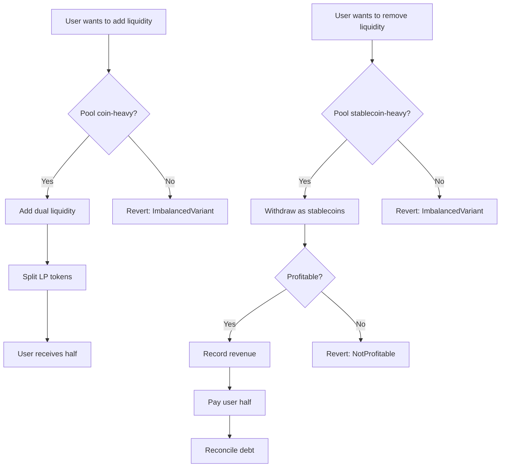

# CurveAdapterV1_1 Analysis & Documentation

## Table of Contents

1. [Overview](#overview)
2. [Contract Architecture](#contract-architecture)
3. [Core Functionality](#core-functionality)
4. [Economic Model](#economic-model)
5. [Security Analysis](#security-analysis)
6. [Test Coverage Analysis](#test-coverage-analysis)
7. [Areas for Improvement](#areas-for-improvement)
8. [References](#references)

## Overview

**Contract Location**: `contracts/curve/CurveAdapterV1_1.sol`

**Purpose**: CurveAdapterV1_1 is a sophisticated liquidity provision adapter that interfaces with Curve Finance's StableSwapNG pools. It facilitates automated liquidity provision while maintaining specific pool balance conditions and generating revenue through controlled arbitrage opportunities.

**Authors**: @samclassix, @wrytlabs

**Key Features**:

-   Automated dual-sided liquidity provision to Curve StableSwap pools
-   Pool imbalance monitoring and enforcement
-   Profit-only withdrawal mechanism
-   Revenue distribution to multiple recipients
-   Role-based access control integration

## Contract Architecture

### Inheritance Chain

```
CurveAdapterV1_1
├── RewardDistributionV1
    ├── IStablecoinModifier
        └── Context (OpenZeppelin)
```

### Key Dependencies

-   **ICurveStableSwapNG**: Interface for Curve's next-generation StableSwap pools
-   **RewardDistributionV1**: Handles profit distribution to multiple recipients
-   **IStablecoinModifier**: Provides role-based access control and stablecoin interaction
-   **SafeERC20**: Secure token transfer operations

### State Variables

#### Core Configuration (Immutable)

```solidity
ICurveStableSwapNG public immutable pool;  // Target Curve pool
IERC20Metadata public immutable coin;     // External token (e.g., USDC)
uint256 public immutable idxS;            // Stablecoin index in pool (0 or 1)
uint256 public immutable idxC;            // Coin index in pool (0 or 1)
```

#### Accounting State

```solidity
uint256 public totalMinted;    // Total stablecoins minted by adapter
uint256 public totalRevenue;   // Accumulated profit from operations
```

### Constructor Parameters

-   `_pool`: Curve StableSwapNG pool address
-   `_idxS`: Index of stablecoin in pool (must be < 2)
-   `_idxC`: Index of external coin in pool (must be < 2)
-   `_receivers[5]`: Array of revenue distribution recipients
-   `_weights[5]`: Corresponding distribution weights

## Core Functionality

### 1. Pool Imbalance Management

#### `checkImbalance()` Function

```solidity
function checkImbalance() public view returns (bool) {
    uint256 correctedAmount = (pool.balances(idxC) * 1 ether) / 10 ** coin.decimals();
    if (pool.balances(idxS) <= correctedAmount) {
        return true;  // Pool favorable for liquidity addition
    } else {
        return false; // Pool unfavorable for liquidity addition
    }
}
```

**Logic**:

-   Normalizes coin balance to 18 decimals for comparison
-   Returns `true` when stablecoin balance ≤ normalized coin balance
-   This indicates pool is "coin-heavy" and favorable for adding both tokens

#### `verifyImbalance()` Function

-   Enforces expected pool state before critical operations
-   Reverts with `ImbalancedVariant` error and current balances if check fails

### 2. Liquidity Addition (`addLiquidity`)

**Location**: `contracts/curve/CurveAdapterV1_1.sol:81-113`

**Process Flow**:

1. **Input Processing**: Convert coin amount to equivalent stablecoin amount (decimal adjustment)
2. **Token Transfer**: Transfer coin from user to adapter (requires approval)
3. **Stablecoin Minting**: Mint equivalent stablecoins using `stable.mintModule()`
4. **Token Approval**: Approve both tokens for pool interaction
5. **Dual Liquidity Addition**: Add both tokens to pool simultaneously
6. **Imbalance Verification**: Ensure pool becomes coin-heavy post-operation
7. **Share Distribution**: Split LP tokens 50/50 between user and adapter

**Key Mechanics**:

-   Doubles minimum shares requirement: `pool.add_liquidity(amounts, minShares * 2)`
-   User receives `shares / 2`, adapter retains other half
-   Updates `totalMinted` tracker for debt accounting

**Constraints**:

-   Only operates when `checkImbalance() == true` (post-operation)
-   Requires successful dual-token addition to pool

### 3. Liquidity Removal (`removeLiquidity`)

**Location**: `contracts/curve/CurveAdapterV1_1.sol:129-160`

**Process Flow**:

1. **LP Token Transfer**: Transfer user's LP tokens to adapter
2. **Liquidity Withdrawal**: Remove liquidity as single asset (stablecoin only)
3. **Imbalance Verification**: Ensure pool becomes stablecoin-heavy post-operation
4. **Profitability Check**: Calculate and verify arbitrage profit exists
5. **Revenue Accounting**: Record profit in `totalRevenue`
6. **Token Transfer**: Send half of withdrawn stablecoins to user
7. **Debt Reconciliation**: Burn minted stablecoins via `_reconcile()`

**Profitability Calculation**:

```solidity
function calcProfitability(uint256 beforeLP, uint256 afterLP, uint256 split) public view returns (uint256) {
    // Calculate required payback based on LP value change
    uint256 calcBeforeSplit = ((1 ether - ((afterLP * 1 ether) / beforeLP)) * totalMinted) / 1 ether;

    if (split > calcBeforeSplit) {
        return split - calcBeforeSplit;  // Profit amount
    } else {
        return 0;  // No profit
    }
}
```

**Constraints**:

-   Reverts with `NotProfitable()` if no arbitrage profit
-   Only operates when `checkImbalance() == false` (post-operation)
-   Doubles user's LP input for withdrawal calculation

### 4. Debt Reconciliation (`_reconcile`)

**Location**: `contracts/curve/CurveAdapterV1_1.sol:178-197`

**Two-Path Logic**:

#### Path 1: Full Debt Payoff

```solidity
if (totalMinted <= amount) {
    if (totalMinted != 0) {
        stable.burn(totalMinted);
        totalMinted = 0;
    }
    _distribute();  // Distribute remaining balance as revenue
    return totalMinted;
}
```

#### Path 2: Partial Debt Payoff

```solidity
else {
    stable.burn(amount);
    totalMinted -= amount;
    return amount;
}
```

## Economic Model

### Revenue Generation Strategy

1. **Market Timing**: Only provide liquidity when pool conditions are favorable (coin-heavy)
2. **Arbitrage Capture**: Extract liquidity only when profitable imbalance exists
3. **Spread Monetization**: Capture difference between provision and extraction rates
4. **Risk Mitigation**: Dual-token approach reduces impermanent loss

### Operational Flow



### Revenue Distribution

Inherited from `RewardDistributionV1`:

-   Up to 5 weighted recipients
-   Automatic distribution on successful debt reconciliation
-   Timelock-protected distribution changes
-   Curator-controlled configuration

## Security Analysis

### Strengths

1. **Imbalance Protection**: Prevents operations during unfavorable market conditions
2. **Profitability Gates**: Ensures all user withdrawals generate protocol revenue
3. **Role-based Access**: Multi-tier permission system (curator, guardian, module)
4. **Debt Tracking**: Precise accounting of minted stablecoin obligations
5. **Decimal Handling**: Proper normalization for cross-decimal comparisons
6. **Safe Token Operations**: Uses OpenZeppelin's SafeERC20 for all transfers

### Potential Risks

#### 1. MEV and Front-running

-   **Risk**: Predictable arbitrage opportunities could be exploited by MEV bots
-   **Impact**: Protocol profits could be extracted before intended operations
-   **Mitigation**: Consider time-delayed operations or commit-reveal schemes

#### 2. Pool Manipulation

-   **Risk**: Large traders could manipulate pool balance to affect adapter operations
-   **Impact**: Could force unfavorable conditions or create artificial arbitrage
-   **Mitigation**: Minimum operation thresholds, time-based restrictions

#### 3. Oracle Dependencies

-   **Risk**: Relies on pool's internal pricing mechanisms
-   **Impact**: Potential manipulation through large trades
-   **Mitigation**: External price validation, circuit breakers

#### 4. Emergency Recovery

-   **Risk**: Funds could become stuck in adapter during market stress
-   **Impact**: User funds and protocol assets at risk
-   **Current Mitigation**: Curator emergency functions (`redeem`, `payOffDebt`)

#### 5. Decimal Precision

-   **Risk**: Rounding errors in decimal conversions
-   **Impact**: Small profit leakage over many operations
-   **Severity**: Low (amounts typically small)

### Access Control Matrix

| Function          | Curator | Guardian | Module | Public |
| ----------------- | ------- | -------- | ------ | ------ |
| `addLiquidity`    | ✓       | ✓        | ✓      | ✓      |
| `removeLiquidity` | ✓       | ✓        | ✓      | ✓      |
| `redeem`          | ✓       | ✗        | ✗      | ✗      |
| `payOffDebt`      | ✓       | ✓        | ✗      | ✗      |
| `setDistribution` | ✓       | ✗        | ✗      | ✗      |

## Test Coverage Analysis

**Test File**: `test/TestCurveAdapter1.ts`

### Test Scenarios Covered

1. **Distribution Setup**: Revenue recipient configuration
2. **Normal Liquidity Addition**: Successful dual-token provision
3. **Pool Imbalance Creation**: Simulated market conditions via swaps
4. **Large Liquidity Support**: Pool stability testing
5. **Unprofitable Withdrawal**: `NotProfitable` error validation
6. **Market Manipulation**: Multiple swap operations
7. **Imbalanced Addition**: `ImbalancedVariant` error validation
8. **Profitable Withdrawal**: Successful revenue generation
9. **Emergency Redemption**: Curator recovery operations

### Test Infrastructure

-   **Network**: Hardhat fork of Ethereum mainnet
-   **Pool**: Real Curve StableSwapNG USDU/USDC pool
-   **Tokens**: Mainnet USDC, deployed USDU stablecoin
-   **Roles**: Impersonated curator, simulated module and users
-   **Scenarios**: Realistic market conditions and edge cases

### Coverage Gaps

1. **Slippage Testing**: No explicit minimum amount validation
2. **Gas Optimization**: No gas usage benchmarking
3. **High-volume Operations**: Limited stress testing
4. **Multi-user Scenarios**: Primarily single-user focused
5. **Time-based Conditions**: No long-term operation testing

## Areas for Improvement

### 1. Enhanced Profitability Logic

**Current Issue**: Simple profit calculation may not account for all costs

```solidity
// Current simplified calculation
uint256 profit = split > calcBeforeSplit ? split - calcBeforeSplit : 0;
```

**Potential Enhancement**:

-   Include gas costs in profitability calculation
-   Account for slippage and fees
-   Dynamic profit thresholds based on market conditions

### 2. MEV Protection

**Suggestions**:

-   Implement time-delayed operations with commit-reveal
-   Add randomized execution windows
-   Use private mempools for sensitive operations

### 3. Advanced Pool Monitoring

**Current**: Simple balance comparison
**Enhanced Options**:

-   Virtual price monitoring
-   Liquidity depth analysis
-   External price oracle integration
-   Multi-block average calculations

### 4. Emergency Mechanisms

**Current**: Basic curator override functions
**Enhanced Options**:

-   Progressive emergency timeouts
-   Multi-signature emergency controls
-   Automated circuit breakers
-   Partial withdrawal capabilities

### 5. Gas Optimization

**Potential Areas**:

-   Batch operations for multiple users
-   Storage layout optimization
-   Reduced external calls
-   Assembly optimizations for math operations

### 6. User Experience

**Enhancements**:

-   Estimated profit/loss preview functions
-   Queue-based operations during unfavorable conditions
-   Partial liquidity provision options
-   Slippage protection parameters

### 7. Monitoring and Analytics

**Additions**:

-   Detailed operation logging
-   Performance metrics tracking
-   Revenue attribution
-   Pool condition history

## References

### External Documentation

-   [Curve StableSwap NG Documentation](https://docs.curve.finance/stableswap-exchange/stableswap-ng/pools/plainpool/)

### Internal Dependencies

-   `RewardDistributionV1`: Revenue distribution system
-   `IStablecoinModifier`: Role-based access control
-   `ICurveStableSwapNG`: Curve pool interface
-   `Stablecoin`: USDU stablecoin implementation

### Related Contracts

-   `CurveAdapterV1.sol`: Previous version (comparison reference)
-   `MorphoAdapterV1_1.sol`: Similar adapter pattern for Morpho protocol
-   `RewardRouterV0.sol`: Alternative revenue routing implementation

### Test Files

-   `test/TestCurveAdapter1.ts`: Primary integration tests
-   `test/TestCurveAdapter0.ts`: Basic functionality tests
-   `test/TestCurveAdapter2.ts`: Advanced scenarios

---

_Generated for USDU Finance protocol development and analysis_
*Last Updated: December 2025*s
